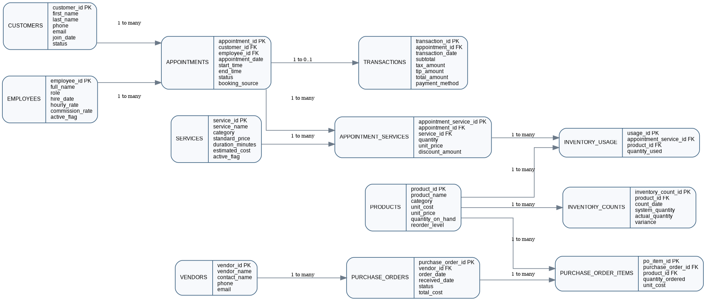

# Hollywood Nails Business Analytics

A portfolio case study showing how SQL, Excel, and business operations knowledge can be used to analyze a service-based business.

> **Data disclosure:** All customer, appointment, transaction, and inventory records in this repository are synthetic portfolio data. No real customer information is included, and the results should not be represented as audited company records.

## Project objective

This project was designed to answer practical operational questions:

- How is revenue changing over time?
- Which services generate the most revenue and estimated gross profit?
- What percentage of customers return?
- Which days and hours have the highest demand?
- Which booking sources have the best completion rate?
- How much is spent on suppliers and inventory?
- Which inventory items show the largest count variances?

## Business background

My professional background includes restaurant management and small-business ownership. I created this project to connect that operational experience with SQL, Excel, reporting, customer analysis, and inventory analytics.

## Tools

- PostgreSQL
- SQL
- Microsoft Excel
- Power BI planning
- GitHub

## Repository structure

```text
Hollywood-Nails-Business-Analytics/
├── data/          Synthetic CSV datasets
├── sql/           Schema, views, and business queries
├── dashboards/    Excel dashboard and Power BI blueprint
├── images/        ER diagram and dashboard images
├── docs/          Data dictionary and project documentation
└── README.md
```

## Dataset

The synthetic dataset covers August 2023 through July 2026 and includes:

- 1,250 synthetic customers
- 9,266 appointments
- 8,449 completed transactions
- 11,880 appointment-service records
- 308 purchase orders
- Monthly inventory counts and estimated inventory usage

## SQL analysis

The SQL folder contains:

1. `01_create_schema.sql` — relational tables, keys, and indexes
2. `02_create_views.sql` — reusable analytical views
3. `03_business_analysis_queries.sql` — 18 business-focused analyses

Examples include:

- Monthly revenue and average ticket
- Month-over-month revenue growth
- Customer repeat rate and lifetime value
- Inactive customer re-engagement list
- Service profitability
- Peak weekday and hour analysis
- Cancellation and no-show rates
- Employee productivity
- Supplier spending and inventory variance

## Excel dashboard

The Excel executive dashboard includes:

- Total revenue
- Completed visits
- Average ticket
- Repeat customer rate
- Monthly revenue trend
- Top services by revenue
- Customer segments
- Booking-source performance
- Payment-method mix

## ER diagram



## Business recommendations

- Align staffing with the busiest weekdays and appointment hours.
- Use automated reminders and re-engagement campaigns for inactive high-value customers.
- Promote services with strong estimated margins and repeat behavior.
- Review recurring inventory variances to identify waste or recording problems.
- Compare booking sources by completion rate before increasing marketing spending.

## Skills demonstrated

- Relational database design
- SQL joins, CTEs, aggregations, and window functions
- KPI definition and reporting
- Customer retention and lifetime-value analysis
- Revenue and service analysis
- Inventory and purchasing analysis
- Translating operational questions into actionable insights

## Author

**Chen Chung Huang**  
Business Operations & Analytics Professional  
Reno, Nevada
