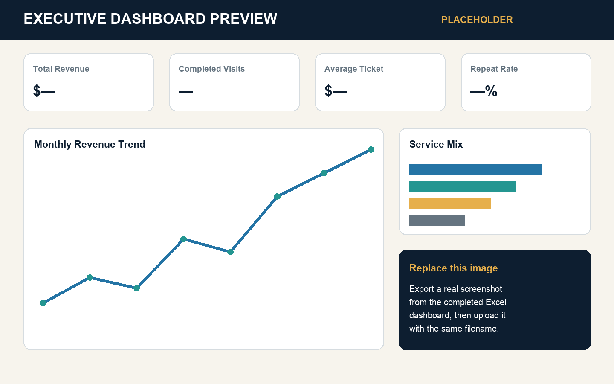
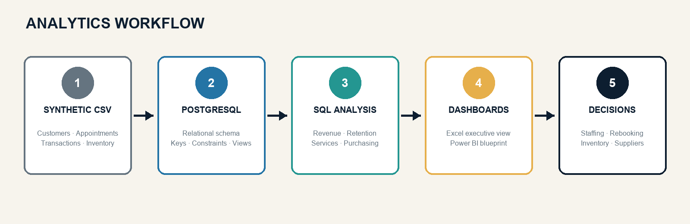

<p align="center">
  
</p>

<h1 align="center">Hollywood Nails Business Analytics</h1>

<p align="center">
  An end-to-end business operations analytics portfolio project built with synthetic salon data.
</p>

<p align="center">
  <a href="https://www.postgresql.org/"></a>
  <a href="https://www.microsoft.com/microsoft-365/excel"></a>
  <a href="https://powerbi.microsoft.com/"></a>
  
  
</p>

<p align="center">
  <a href="https://github.com/Chen-Huang-Analytics">GitHub Profile</a>
  ·
  <a href="https://www.linkedin.com/in/chen-chung-huang-8757203b1">LinkedIn</a>
  ·
  <a href="mailto:s598a89w@gmail.com">Email</a>
</p>

---

## Executive dashboard preview

<p align="center">
  
</p>

> **Preview note:** The image above is a clearly labeled portfolio preview placeholder.
> Replace it with a screenshot exported from the completed Excel dashboard when available.
> The workbook itself remains in the `dashboards/` folder.

## Executive summary

Hollywood Nails Business Analytics is a portfolio case study that connects
real-world small-business operations experience with database design, SQL,
reporting, and dashboard development.

The project models a service-based salon operation and analyzes the business
through five decision areas:

- Revenue and average ticket performance
- Customer retention and customer lifetime value
- Service demand and profitability
- Appointment utilization and cancellation behavior
- Purchasing, inventory control, and supplier spending

The deliverables are designed to answer practical management questions rather
than demonstrate tools in isolation.

## Data disclosure

> **Important:** All customer, appointment, service, employee, payment,
> purchasing, and inventory records in this repository are **synthetic
> portfolio data**. They were generated for learning and demonstration.
> They are not actual Hollywood Nails customer records, employee records,
> financial statements, or confidential business data.

The project is inspired by hands-on salon operations experience, but no real
customer names, phone numbers, email addresses, appointment histories, or
payment details are published.

## Project objective

The objective is to build an end-to-end analytics workflow that demonstrates
how operational records can be transformed into useful management reporting.

The workflow includes:

1. Defining business questions and decision needs
2. Designing a normalized relational database
3. Preparing synthetic CSV source data
4. Loading the data into PostgreSQL
5. Creating reusable SQL views
6. Writing business analysis queries
7. Summarizing performance in an Excel executive dashboard
8. Translating findings into operational recommendations

## Business context

A salon owner must coordinate appointments, customer service, purchasing,
inventory, revenue, and daily workflow with limited time and staff capacity.
Operational data may exist across appointment systems, spreadsheets, receipts,
and manual inventory records.

This project organizes those activities into one analytical model so that a
manager can monitor performance consistently and make evidence-based decisions.

## Business questions

### Revenue and performance

- How is monthly revenue changing over time?
- What is the month-over-month growth rate?
- What is the average completed transaction value?
- Which services contribute the most revenue?
- Which services produce the strongest estimated margin?

### Customers and retention

- What share of customers return for another completed appointment?
- Which customers have the highest lifetime value?
- How frequently do repeat customers visit?
- Which customers have not returned in the last 90 days?
- Which services are associated with repeat visits?

### Appointments and capacity

- Which days and hours have the highest appointment demand?
- What is the completion rate?
- What is the cancellation and no-show rate?
- Which booking sources generate the most completed appointments?
- Where are there underused time periods?

### Inventory and purchasing

- How much is spent by supplier?
- Which products are reordered most often?
- Where do physical inventory counts differ from expected quantities?
- Which items approach minimum stock levels?
- How can ordering decisions reduce shortages and excess stock?

## Analytics workflow

<p align="center">
  
</p>

The project follows a simple decision pipeline:

```text
Synthetic CSV source data
        ↓
PostgreSQL relational database
        ↓
Reusable SQL views and analysis queries
        ↓
Excel executive dashboard and Power BI blueprint
        ↓
Operational insights and recommendations
```

## Technology stack

| Tool | Use in this project |
|---|---|
| PostgreSQL | Relational schema, constraints, indexes, and analytical views |
| SQL | Revenue, retention, service, appointment, supplier, and inventory analysis |
| Microsoft Excel | KPI reporting and executive dashboard |
| Power BI | Multi-page dashboard planning and future interactive reporting |
| CSV | Portable synthetic source data |
| GitHub | Documentation, version control, and portfolio presentation |

## Dataset at a glance

The synthetic dataset covers the major parts of a salon operating model.

| Subject area | Example contents |
|---|---|
| Customers | Join date, contact placeholders, referral source, status |
| Employees | Role, hire date, compensation fields, active status |
| Services | Category, price, duration, estimated cost |
| Appointments | Date, time, customer, employee, status, booking source |
| Transactions | Subtotal, discount, tax, tip, total, payment method |
| Products | Category, unit cost, selling price, stock thresholds |
| Purchasing | Vendor, purchase order, quantity, cost, purchase date |
| Inventory | Physical counts, expected quantities, variances, usage |

For exact column definitions and field notes, see the data dictionary in
`docs/`.

## Relational database design

<p align="center">
  
</p>

The schema separates operational subjects into related tables to reduce
duplication and preserve analytical flexibility.

Core relationships include:

- One customer can have many appointments.
- One employee can perform many appointments.
- One appointment can contain multiple services.
- A completed appointment can produce a transaction.
- One vendor can receive many purchase orders.
- One purchase order can contain many product line items.
- Products can appear in inventory counts and usage records.

## Repository structure

```text
Hollywood-Nails-Business-Analytics/
├── README.md
├── data/
│   ├── customers.csv
│   ├── employees.csv
│   ├── services.csv
│   ├── appointments.csv
│   ├── appointment_services.csv
│   ├── transactions.csv
│   ├── products.csv
│   ├── vendors.csv
│   ├── purchase_orders.csv
│   ├── purchase_order_items.csv
│   ├── inventory_counts.csv
│   └── inventory_usage.csv
├── sql/
│   ├── 01_create_schema.sql
│   ├── 02_create_views.sql
│   └── 03_business_analysis_queries.sql
├── dashboards/
│   ├── Hollywood_Nails_Executive_Dashboard.xlsx
│   └── Hollywood_Nails_PowerBI_Blueprint.pptx
├── images/
│   ├── hollywood-nails-banner.png
│   ├── executive-dashboard-preview.png
│   ├── analytics-workflow.png
│   └── er-diagram.png
└── docs/
    ├── database-design.*
    ├── data-dictionary.*
    ├── business-recommendations.md
    └── portfolio-talking-points.md
```

> Your current GitHub repository contains this project folder one level below
> the repository root. The paths in this README are intentionally relative to
> the nested `Hollywood-Nails-Business-Analytics/` folder where this README and
> the `images/` folder live together.

## Database objects

The PostgreSQL project contains 12 main tables:

1. `customers`
2. `employees`
3. `services`
4. `appointments`
5. `appointment_services`
6. `transactions`
7. `products`
8. `vendors`
9. `purchase_orders`
10. `purchase_order_items`
11. `inventory_counts`
12. `inventory_usage`

The SQL also defines keys, relationships, constraints, and indexes used to
support reliable joins and common analytical filters.

## Reusable SQL views

Reusable views simplify reporting logic and keep dashboard queries consistent.

Examples include:

- A completed-transaction view joining appointments and payments
- A service-sales view connecting service line items to revenue activity
- A customer-summary view aggregating visits, spending, and recent activity

These views create a stable reporting layer between raw operational tables and
business-facing analysis.

## SQL analysis library

The analysis file contains business queries grouped around decision areas.

### 1. Monthly revenue

Summarizes completed transaction revenue by month for trend reporting.

### 2. Month-over-month growth

Uses window functions to compare each month with the preceding month.

### 3. Average ticket value

Calculates the average total for completed transactions.

### 4. Service revenue ranking

Ranks services and categories by generated revenue.

### 5. Estimated service margin

Compares service price with estimated direct cost for portfolio modeling.

### 6. Repeat-customer rate

Identifies customers with more than one completed visit and calculates their
share of the completed-customer population.

### 7. Customer lifetime value

Aggregates completed visits and total spending by customer.

### 8. Re-engagement candidates

Finds customers whose most recent completed visit was more than 90 days ago.

### 9. Peak weekday demand

Groups appointment activity by day of week.

### 10. Peak hourly demand

Groups appointment activity by starting hour to identify capacity pressure.

### 11. Appointment status analysis

Measures completed, canceled, and no-show activity.

### 12. Booking-source performance

Compares sources based on appointment volume and completion behavior.

### 13. Employee activity

Summarizes completed services and associated transaction activity by employee.

### 14. Payment-method mix

Shows how customers pay and supports payment-process planning.

### 15. Supplier spending

Aggregates purchase value by vendor.

### 16. Product purchasing

Identifies frequently purchased and high-spend products.

### 17. Inventory variance

Compares expected stock with physical count results.

### 18. Reorder monitoring

Flags products at or below modeled minimum stock thresholds.

## Excel executive dashboard

The Excel workbook is designed as a management-facing summary rather than a raw
data workbook.

### KPI cards

- Total revenue
- Completed transactions
- Average ticket value
- Repeat-customer rate

### Trend and mix views

- Monthly revenue trend
- Revenue by service
- Customer activity by weekday
- Payment-method distribution
- Appointment-source distribution
- Appointment completion and cancellation status

### Supporting analysis tabs

- Monthly Performance
- Service Analysis
- Customer Analysis
- Operations
- Raw Transactions

## Dashboard highlights

The dashboard layer is designed to help a manager move from monitoring to
action.

| Dashboard signal | Potential management action |
|---|---|
| Declining monthly revenue | Review demand, pricing, capacity, and customer return behavior |
| Low repeat-customer rate | Introduce follow-up and rebooking workflows |
| Underused weekday period | Test targeted promotions or scheduling changes |
| High cancellation rate | Improve reminders and cancellation policies |
| Low-stock product | Reorder before service availability is affected |
| Large inventory variance | Review receiving, usage recording, and count procedures |

## Business recommendations

### 1. Create a customer re-engagement list

Use the 90-day inactive-customer query to prepare a controlled follow-up list.
Measure return appointments rather than only email opens or messages sent.

### 2. Track repeat rate as a core KPI

Review repeat-customer rate monthly and by service category. Investigate whether
services with strong repeat behavior should receive more scheduling capacity or
promotion.

### 3. Align staffing with appointment demand

Compare weekday and hourly appointment patterns before changing schedules.
Maintain service quality during peak periods while testing demand-building
actions during quieter periods.

### 4. Review cancellation and no-show patterns

Segment appointment outcomes by booking source, weekday, hour, and customer
history. Use the results to refine reminders, confirmations, and policies.

### 5. Establish a repeatable inventory-control cycle

Combine minimum-stock alerts, receiving records, usage data, and monthly
physical counts. Investigate material variances instead of treating the count as
an isolated administrative task.

### 6. Monitor supplier concentration

Review total spend and order frequency by vendor. Document alternatives for
business-critical products to reduce disruption risk.

### 7. Maintain a monthly operating review

Use a consistent review agenda covering revenue, average ticket, service mix,
retention, appointment outcomes, purchasing, and inventory variance.

## Skills demonstrated

### Business and operations

- Business operations analysis
- KPI definition and reporting
- Customer retention analysis
- Appointment and capacity analysis
- Inventory control concepts
- Purchasing and supplier analysis
- Process-improvement recommendations

### Data and technical

- Relational database design
- Primary and foreign key modeling
- SQL joins and aggregations
- Common table expressions
- Window functions
- Reusable analytical views
- Data validation and documentation
- Excel dashboard development
- GitHub project documentation

### Communication

- Translating operational questions into analytical requirements
- Explaining data limitations and synthetic-data disclosure
- Presenting findings for a nontechnical manager
- Connecting analysis with practical next actions

## Limitations and next steps

### Current limitations

- The dataset is synthetic and cannot validate real-world business outcomes.
- Cost and margin fields are modeled for portfolio analysis.
- The Power BI deliverable is currently a blueprint rather than a finished
  interactive `.pbix` report.
- Dashboard preview imagery should be replaced with exported workbook or Power
  BI screenshots when final visuals are available.
- Recommendations require real operational testing before implementation.

### Planned enhancements

- Replace the dashboard preview placeholder with a verified Excel screenshot.
- Build and publish the interactive Power BI report file.
- Add automated data-quality checks.
- Add a date dimension for more advanced time intelligence.
- Add tests for orphaned keys, invalid statuses, and negative values.
- Add reproducible database-loading instructions or scripts.
- Add screenshots showing selected SQL outputs.
- Add a short executive report in PDF format.

## Author

**Chen Chung Huang**  
Business Operations & Analytics Professional  
Reno, Nevada, United States

- GitHub: [Chen-Huang-Analytics](https://github.com/Chen-Huang-Analytics)
- LinkedIn: [chen-chung-huang-8757203b1](https://www.linkedin.com/in/chen-chung-huang-8757203b1)
- Email: [s598a89w@gmail.com](mailto:s598a89w@gmail.com)

---

<p align="center">
  Built as a transparent, synthetic-data portfolio project for Business Operations and Analytics roles.
</p>
